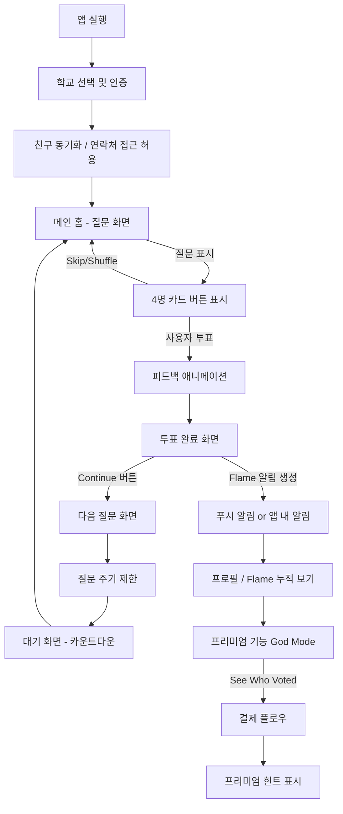

# Gas 앱 User Flow 리서치

> 본 문서는 Gas 앱과 TBH 앱의 UX/UI 분석 및 Circly 적용 제안을 담고 있습니다.
> 원본: `prd/00-prd.md` 섹션 13에서 분리됨

## 1. Gas 앱 메인 투표 화면

### 1.1 질문 메인 화면
Gas 앱의 메인 투표 화면은 카드 형식의 중앙 배치 UI로 구성됩니다. 질문 제목은 화면 중앙에 1개 이모지와 함께 간결하게 표시되며, 아래에는 선택지로 친구 이름 4개가 카드처럼 그룹으로 제시됩니다. 상단에는 전체 질문 수 대비 현재 진행도를 알려주는 프로그레스 바와 숫자가 표시되어 있어 사용자로 하여금 전체 목표를 인지시킵니다. 화면 하단에는 주로 "Skip"(다음으로 넘어가기), "Shuffle"(순서 섞기) 등의 버튼이 있어, 사용자는 원하지 않는 질문을 건너뛰거나 선택지 순서를 랜덤하게 바꿀 수 있습니다.

**핵심 요소**:
- **질문 표시**: 화면 상단에 간단한 질문 문구와 대표 이모지가 나타나며, 질문은 긍정적 성격의 칭찬형 프롬프트(예: "누가 가장 친절해 보이나요?")로 구성됩니다.
- **선택지 UI**: 4명의 친구 이름이 카드 형태로 그룹핑되어 직관적으로 보입니다. 각 버튼을 눌러 투표할 수 있고, 터치 영역은 하단 Thumb Zone(엄지 영역)에 배치되어 접근성을 높였습니다.
- **진행 표시**: 상단 진행 바와 숫자가 함께 노출되어, 전체에서 현재 몇 번째 질문인지 알 수 있습니다.

### 1.2 투표 버튼 및 액션
사용자는 친구 이름 버튼을 눌러 투표합니다. 각 카드형 선택지(이름)를 터치하면 해당 인물에 투표가 이루어집니다. 하단에는 "Skip" 버튼과 "Shuffle" 버튼이 있어, 답하고 싶지 않은 질문은 건너뛸 수 있고(투표하지 않고 넘어감), 선택지 순서를 섞어 다시 한번 볼 수도 있습니다. Skip/Shuffle 기능으로 사용자 행동 선택 범위를 넓혀 주어 부담감을 줄여 줍니다.

### 1.3 투표 후 화면 및 피드백
한 번 투표를 완료하면 즉시 피드백 화면으로 넘어갑니다. 먼저 사용자가 선택한 항목과 해당 항목에 투표한 친구 수가 실시간으로 노출되어 어떤 선택을 했는지 인지시켜 줍니다. 이어서 뽑힌 사람(투표 결과 최다 득표자)에게는 "불꽃(flame)" 보상이 주어집니다. 불꽃은 일종의 포인트 개념으로, 인기 투표에 뽑힌 사람에게 부여됩니다.

### 1.4 다음 질문 및 대기 화면
하나의 질문에 답한 뒤 Continue를 누르면 곧바로 다음 질문 화면으로 전환됩니다. Gas 앱은 한 시간마다 새로운 질문이 자동 갱신되므로, 사용자는 즉시 다음 질문을 계속 투표할 수 있습니다.

---

## 2. Gas 사용자 여정 (온보딩 → 투표 → 보상)

### 2.1 온보딩(첫 실행)
1. **권한·기본 정보**
   - 위치 권한 허용 → 근처 학교 목록에서 자신의 학교 선택
   - 연락처 접근 허용 → 연락처/학교·친구의 친구를 기반으로 친구 추천/추가
   - (일부 화면에서) 학년/성별 선택으로 매칭 정확도와 힌트 정확도 향상
   - 목적: 오프라인 학교 그래프를 앱 내부에 구성해 빠른 친구 발견성 확보

2. **홈(라운드 대기/시작 화면)**
   - "새 라운드 시작(ex. 'New Polls in…')" 카운트다운 또는 즉시 시작 가능한 Q 카드 진입 버튼
   - 초기 이용 지역·사용자 수가 충분치 않을 때는 대기/초대 유도가 보일 수 있음

### 2.2 투표 라운드(질문 카드 UI)
- **문항 형태**: 앱이 제공하는 칭찬성·가벼운 친화·약간의 플러팅 계열 프롬프트(질문)가 중앙에 표시됩니다.
- **답변 영역**: 4명의 친구 이름이 버튼 형태로 표시 → 한 명 탭하여 투표
- **라운드 길이/쿨다운**: 여러 출처에서 한 시간마다 새로운 묶음(라운드)이 열린다고 보도

### 2.3 투표 결과 → 알림(Inbox)
- 내가 선택한 상대 → 그 상대의 Inbox에 🔥(Flame) 알림 도착
- 보낸 사람 익명. 다만 성별/학년 등의 힌트는 기본 제공

### 2.4 라운드 종료/다음 라운드 대기
- 라운드 소진 시 대기 화면(카운트다운)으로 전환
- 초대 공유(Invite)를 통해 대기 시간을 우회하거나, 다음 라운드에서 후보 폭이 넓어지는 등의 바이럴 유도

---

## 3. Gas 운영 로직

### 3.1 투표 주기 / 라운드
- 매 시간 새로운 질문 세트가 열림
- 일부 지역/시기에는 한 라운드에 약 12문항

### 3.2 알림(Flame)
- 선택받은 사람에게 Flame(🔥)가 Inbox로 전송 → 도파민 루프 형성
- 익명성은 유지되나, 성별만 보이는 제한적 공개가 기본 설계

### 3.3 God Mode(수익화)
- 유료 구독 애드온
- "누가 보냈는지" 추정/확인의 힌트 해금(이니셜·학년·시간·거점 등)
- 인박스 필터/무제한 힌트 제공

### 3.4 안전 장치·정책
- 사용자 생성 문항 금지, DM/댓글·공개 타임라인 부재 → 부정적 익명성 리스크 축소
- 학교 네트워크는 "친구 발견을 쉽게 하는 용도"이며, 학교는 기능적으로 디렉터리 역할뿐

### 3.5 확산 메커니즘(성장)
- 학교 단위 네트워크 효과 + 시간제 라운드(결핍·대기) + 알림 보상(🔥) → FOMO 극대화
- 연락처 동기화·친구의 친구 추천 등으로 초기 그래프 형성 비용 최소화

---

## 4. TBH 앱 비교

2017년 출시, 페이스북 인수 후 2018년 종료. Gas의 전신격 레퍼런스로 자주 비교됩니다.

### 4.1 투표 화면/조작
- 앱이 쓴 프롬프트 + 4명 후보 중 선택은 Gas와 동일한 뼈대
- Shuffle/Skip UI가 명시적

### 4.2 보상 체계
- 선택받은 사람은 Gems(보석)를 적립
- 성별 색상 코드 등 시각적 피드백
- 랭킹/기록은 인앱에서 열람

### 4.3 온보딩
- 학교/학년 선택, 연락처 업로드 기반 친구 매칭은 Gas와 유사

### 4.4 정책·철학
- 사용자 문항 금지(프롬프트는 앱이 작성)로 안전성 확보를 시도

### 4.5 서비스 역사
- 페이스북(메타) 인수 후 8개월 만에 종료(저사용)
- Gas의 "두 번째 시도" 서사에 자주 인용

---

## 5. Gas vs. TBH 핵심 비교

### 유사점
- 앱 제공 칭찬성 프롬프트(UGC 질문 금지) + 4명 후보 중 택1 구조
- 학교·연락처 기반 네트워킹
- 알림형 보상(TBH는 Gems, Gas는 Flames)
- 안전성 초점: DM 부재, 긍정 메시지 중심

### 차이점
| 항목 | Gas | TBH |
|------|-----|-----|
| 주기성 | 시간제 라운드(시간당) 구조 명확 | 라운드 제한 있으나 덜 명시적 |
| 수익화 | God Mode(힌트 해금형 구독) | 보석 인앱 동기 부여 요소 |
| 서비스 연혁 | 2022년 성장, 2023년 Discord 인수 | 2017-2018 단명 |

---

## 6. 화면 단위 사용자 플로우 (예시 시나리오)

**목표**: "한 라운드에서 1표 행사하고, 받은 불꽃을 확인"까지의 터치 단위 흐름

1. **앱 실행 → 홈/라운드 대기 화면**
   - 상태: "다음 라운드까지 12:34" 카운트다운 또는 "Start"/"Answer Polls" 버튼 활성
   - 액션: [Start/Answer] 탭 → 문항 카드로 전환

2. **문항 카드(프롬프트 + 4명 후보)**
   - 액션A: 후보 중 1명 탭 → 즉시 다음 문항으로 자연스러운 애니메이션 전환
   - 액션B: [Skip]으로 넘김 / [Shuffle]로 후보 재구성

3. **라운드 종료 화면**
   - 상태: "You're out of polls for now" 및 카운트다운 노출
   - 액션: [Invite friends] / [Enable notifications] 제안

4. **알림(Inbox) 확인**
   - 화면: Flames 리스트(최근 받은 칭찬), 힌트 뱃지
   - 액션: [Try God Mode] CTA로 힌트 확장 유도(유료)

---

## 7. 문항·톤(질문 세트) 특성

긍정/유쾌/라이트 플러팅 중심. 예시:
- "문제 생겨도 쫄지 않을 사람은?"
- "메인 캐릭터 바이브 있는 사람은?"
- "쿨함이 국룰인 사람은?"
- "가장 아름다운 사람은?"

**사용자 문항 생성 불가**: 안전·톤 유지 목적

---

## 8. Gas의 포지셔닝·리스크

- **긍정성 지향**: 익명 칭찬으로 자존감 고양을 전면에 내세움
- **우려 지점**: 익명성/랭킹성 구조가 불안·FOMO를 자극할 수 있다는 교육 매체/부모 가이드의 지적
- **학교 역할**: 그래프 형성을 쉽게 하는 디렉터리로서만 기능

---

## 9. 서비스 연혁 타임라인

| 앱 | 연혁 |
|----|------|
| TBH | 2017 App Store 1위 → Facebook 인수(2017.10) → 종료(2018.7) |
| Gas | 2022 하반기 급성장, iOS 중심 확산 → Discord 인수(2023.1) |

---

## 10. Circly 적용 제안

Circly 앱이 Gas와 유사한 익명 투표 경험을 목표로 한다면:

### 벤치마킹 요소
- 직관적인 카드 UI 배치
- 뽑힌 사람에게 칭찬 아이콘(불꽃 등) 지급
- 질문당 4지선다 투표
- Skip/Shuffle 버튼
- 답변 즉시 진행 상황 표시(프로그레스 바와 숫자)
- 간편한 넘어가기 버튼

### 수익화 고려
- God Mode처럼 프리미엄 기능 도입 가능
- 타인을 선택한 사람의 정보를 순차적으로 공개하는 UX 설계

### 주의사항
- 청소년 대상인 점을 고려해 개인정보 노출 수준과 안전장치를 신중히 설계
- 긍정 UX 강조(부정적 질문 차단, 따뜻한 미션 제공)
- 게임적 보상 시스템(축하 화면, 포인트 등) 도입

---

## 11. 화면 플로우차트

---

## 12. Figma 스토리보드 배치 가이드

1. **첫 번째 프레임 (Onboarding)**: 학교 선택, 연락처 허용 UI
2. **두 번째 프레임 (Question)**: 질문 + 카드 선택 화면
3. **세 번째 프레임 (Feedback)**: 투표 완료 애니메이션
4. **네 번째 프레임 (Notification)**: Flame 알림 화면
5. **다섯 번째 프레임 (Result / Profile)**: Flame 누적 보기
6. **여섯 번째 프레임 (God Mode CTA)**: "See Who Likes You" 버튼 → 결제
