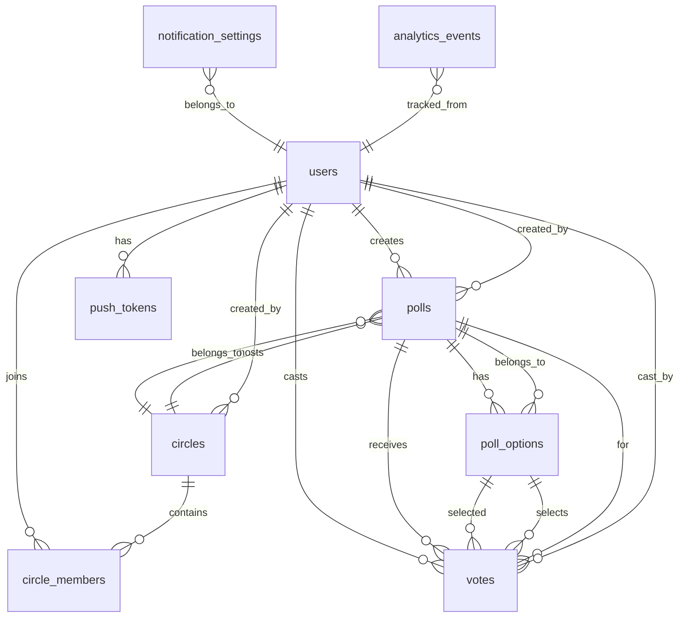

# Database Design - Supabase PostgreSQL 설계

## 데이터베이스 스키마 설계

### 1. 테이블 구조 및 관계

#### 1.1 ERD (Entity Relationship Diagram)


### 2. 상세 테이블 정의

#### 2.1 Users 테이블
```sql
CREATE TABLE users (
    id UUID PRIMARY KEY DEFAULT gen_random_uuid(),
    device_id VARCHAR(255) UNIQUE NOT NULL,
    created_at TIMESTAMP WITH TIME ZONE DEFAULT NOW(),
    updated_at TIMESTAMP WITH TIME ZONE DEFAULT NOW(),
    last_active_at TIMESTAMP WITH TIME ZONE DEFAULT NOW(),
    is_active BOOLEAN DEFAULT TRUE,
    app_version VARCHAR(20),
    platform VARCHAR(10), -- 'ios' | 'android'
    
    -- 인덱스
    CONSTRAINT users_device_id_key UNIQUE (device_id)
);

-- 인덱스 생성
CREATE INDEX idx_users_device_id ON users(device_id);
CREATE INDEX idx_users_last_active ON users(last_active_at);
CREATE INDEX idx_users_created_at ON users(created_at);
```

#### 2.2 Push Tokens 테이블
```sql
CREATE TABLE push_tokens (
    id UUID PRIMARY KEY DEFAULT gen_random_uuid(),
    user_id UUID REFERENCES users(id) ON DELETE CASCADE,
    token VARCHAR(1024) NOT NULL,
    platform VARCHAR(10) NOT NULL, -- 'ios' | 'android' | 'web'
    is_active BOOLEAN DEFAULT TRUE,
    created_at TIMESTAMP WITH TIME ZONE DEFAULT NOW(),
    updated_at TIMESTAMP WITH TIME ZONE DEFAULT NOW(),
    
    -- 한 유저가 여러 디바이스를 가질 수 있음
    CONSTRAINT push_tokens_user_token_unique UNIQUE (user_id, token)
);

CREATE INDEX idx_push_tokens_user_id ON push_tokens(user_id);
CREATE INDEX idx_push_tokens_active ON push_tokens(user_id, is_active);
```

#### 2.3 Circles 테이블
```sql
CREATE TABLE circles (
    id UUID PRIMARY KEY DEFAULT gen_random_uuid(),
    name VARCHAR(100) NOT NULL,
    creator_id UUID REFERENCES users(id) ON DELETE CASCADE,
    
    -- 초대 시스템
    invite_code VARCHAR(6) UNIQUE NOT NULL,
    invite_link_id VARCHAR(255) UNIQUE NOT NULL,
    
    -- 제한 사항
    max_members INTEGER DEFAULT 50 CHECK (max_members IN (10, 25, 50)),
    
    -- 만료 시간
    expires_at TIMESTAMP WITH TIME ZONE NOT NULL,
    
    -- 상태 관리
    is_active BOOLEAN DEFAULT TRUE,
    created_at TIMESTAMP WITH TIME ZONE DEFAULT NOW(),
    updated_at TIMESTAMP WITH TIME ZONE DEFAULT NOW(),
    
    -- 통계 (캐싱용)
    member_count INTEGER DEFAULT 0,
    poll_count INTEGER DEFAULT 0
);

-- 인덱스 및 제약조건
CREATE UNIQUE INDEX idx_circles_invite_code ON circles(invite_code) WHERE is_active = TRUE;
CREATE UNIQUE INDEX idx_circles_invite_link ON circles(invite_link_id) WHERE is_active = TRUE;
CREATE INDEX idx_circles_creator ON circles(creator_id);
CREATE INDEX idx_circles_expires_at ON circles(expires_at);
```

#### 2.4 Circle Members 테이블
```sql
CREATE TABLE circle_members (
    id UUID PRIMARY KEY DEFAULT gen_random_uuid(),
    circle_id UUID REFERENCES circles(id) ON DELETE CASCADE,
    user_id UUID REFERENCES users(id) ON DELETE CASCADE,
    nickname VARCHAR(20) NOT NULL,
    
    -- 역할 관리 (확장 가능)
    role VARCHAR(20) DEFAULT 'member', -- 'admin' | 'member'
    
    -- 참여 정보
    joined_at TIMESTAMP WITH TIME ZONE DEFAULT NOW(),
    is_active BOOLEAN DEFAULT TRUE,
    
    -- 통계 (사용자 활동도 추적)
    polls_created INTEGER DEFAULT 0,
    votes_cast INTEGER DEFAULT 0,
    last_activity_at TIMESTAMP WITH TIME ZONE DEFAULT NOW(),
    
    -- 제약조건: 한 사용자는 같은 Circle에 한 번만 참여
    CONSTRAINT unique_circle_user UNIQUE (circle_id, user_id),
    -- 같은 Circle 내에서 닉네임 중복 방지
    CONSTRAINT unique_circle_nickname UNIQUE (circle_id, nickname)
);

-- 인덱스
CREATE INDEX idx_circle_members_circle ON circle_members(circle_id, is_active);
CREATE INDEX idx_circle_members_user ON circle_members(user_id, is_active);
CREATE INDEX idx_circle_members_activity ON circle_members(last_activity_at);
```

#### 2.5 Question Templates 테이블 (새로 추가)
```sql
CREATE TABLE question_templates (
    id UUID PRIMARY KEY DEFAULT gen_random_uuid(),
    category VARCHAR(50) NOT NULL, -- '외모', '성격', '재능', '특별한날'
    question_text TEXT NOT NULL,
    is_active BOOLEAN DEFAULT TRUE,
    created_at TIMESTAMP WITH TIME ZONE DEFAULT NOW(),
    
    -- 사용 통계 (인기 질문 추적용)
    usage_count INTEGER DEFAULT 0,
    
    CONSTRAINT unique_question_text UNIQUE (question_text)
);

-- 기본 질문 템플릿 데이터 삽입
INSERT INTO question_templates (category, question_text) VALUES
('외모', '가장 잘생긴/예쁜 사람은?'),
('외모', '오늘 패션이 가장 멋진 사람은?'),
('외모', '미소가 가장 예쁜 사람은?'),
('성격', '가장 친절한 사람은?'),
('성격', '가장 재밌는 사람은?'),
('성격', '가장 든든한 사람은?'),
('재능', '가장 똑똑한 사람은?'),
('재능', '운동을 가장 잘하는 사람은?'),
('재능', '노래를 가장 잘하는 사람은?'),
('특별한날', '오늘 기분이 가장 좋아 보이는 사람은?'),
('특별한날', '가장 열심히 공부하는 사람은?');

CREATE INDEX idx_question_templates_category ON question_templates(category, is_active);
CREATE INDEX idx_question_templates_usage ON question_templates(usage_count DESC);
```

#### 2.6 Polls 테이블 (수정됨)
```sql
CREATE TABLE polls (
    id UUID PRIMARY KEY DEFAULT gen_random_uuid(),
    circle_id UUID REFERENCES circles(id) ON DELETE CASCADE,
    creator_id UUID REFERENCES users(id) ON DELETE CASCADE,
    
    -- 선택된 질문 템플릿
    template_id UUID REFERENCES question_templates(id),
    question_text TEXT NOT NULL, -- 템플릿에서 복사된 실제 질문
    
    -- 타이밍
    created_at TIMESTAMP WITH TIME ZONE DEFAULT NOW(),
    deadline TIMESTAMP WITH TIME ZONE NOT NULL,
    
    -- 설정
    is_anonymous BOOLEAN DEFAULT TRUE,
    max_votes_per_user INTEGER DEFAULT 1,
    
    -- 상태
    is_active BOOLEAN DEFAULT TRUE,
    is_closed BOOLEAN DEFAULT FALSE,
    
    -- 통계 캐싱
    total_votes INTEGER DEFAULT 0,
    total_participants INTEGER DEFAULT 0,
    
    -- 제약조건
    CHECK (deadline > created_at)
);

-- 인덱스
CREATE INDEX idx_polls_circle ON polls(circle_id, is_active);
CREATE INDEX idx_polls_creator ON polls(creator_id);
CREATE INDEX idx_polls_deadline ON polls(deadline, is_active);
CREATE INDEX idx_polls_created_at ON polls(created_at);
```

#### 2.7 Poll Options 테이블 (Circle 멤버 기반으로 수정)
```sql
CREATE TABLE poll_options (
    id UUID PRIMARY KEY DEFAULT gen_random_uuid(),
    poll_id UUID REFERENCES polls(id) ON DELETE CASCADE,
    
    -- Circle 멤버 정보 (선택지가 사람이므로)
    member_id UUID REFERENCES circle_members(id) ON DELETE CASCADE,
    member_nickname VARCHAR(20) NOT NULL, -- 투표 생성 시점의 닉네임 저장
    display_order INTEGER NOT NULL,
    
    -- 통계 캐싱
    vote_count INTEGER DEFAULT 0,
    
    created_at TIMESTAMP WITH TIME ZONE DEFAULT NOW(),
    
    -- 제약조건: 같은 투표 내에서 같은 멤버 중복 방지
    CONSTRAINT unique_poll_member UNIQUE (poll_id, member_id),
    -- 같은 투표 내에서 순서 중복 방지
    CONSTRAINT unique_poll_option_order UNIQUE (poll_id, display_order)
);

-- 인덱스
CREATE INDEX idx_poll_options_poll ON poll_options(poll_id, display_order);
CREATE INDEX idx_poll_options_member ON poll_options(member_id);
```

#### 2.8 Votes 테이블 (익명성 보장)
```sql
CREATE TABLE votes (
    id UUID PRIMARY KEY DEFAULT gen_random_uuid(),
    poll_id UUID REFERENCES polls(id) ON DELETE CASCADE,
    option_id UUID REFERENCES poll_options(id) ON DELETE CASCADE,
    user_id UUID REFERENCES users(id) ON DELETE CASCADE,
    
    -- 익명성 보장을 위한 해시
    -- 실제 투표 내용은 이 해시를 통해서만 연결되고, 직접적인 연결은 분리
    anonymous_hash VARCHAR(255) NOT NULL,
    
    -- 메타데이터
    created_at TIMESTAMP WITH TIME ZONE DEFAULT NOW(),
    ip_hash VARCHAR(255), -- IP 해시 (어뷰징 방지용)
    user_agent_hash VARCHAR(255), -- User-Agent 해시
    
    -- 제약조건: 한 사용자는 같은 투표에 한 번만 참여
    CONSTRAINT unique_poll_user_vote UNIQUE (poll_id, user_id)
);

-- 인덱스
CREATE INDEX idx_votes_poll ON votes(poll_id);
CREATE INDEX idx_votes_option ON votes(option_id);
CREATE INDEX idx_votes_user ON votes(user_id);
CREATE INDEX idx_votes_created_at ON votes(created_at);
CREATE INDEX idx_votes_anonymous_hash ON votes(anonymous_hash);
```

#### 2.9 Notification Settings 테이블
```sql
CREATE TABLE notification_settings (
    id UUID PRIMARY KEY DEFAULT gen_random_uuid(),
    user_id UUID REFERENCES users(id) ON DELETE CASCADE UNIQUE,
    
    -- 알림 설정
    poll_start_enabled BOOLEAN DEFAULT TRUE,
    poll_deadline_enabled BOOLEAN DEFAULT TRUE,
    poll_result_enabled BOOLEAN DEFAULT TRUE,
    
    -- 조용한 시간 설정
    quiet_hours_enabled BOOLEAN DEFAULT FALSE,
    quiet_start_hour INTEGER DEFAULT 22 CHECK (quiet_start_hour BETWEEN 0 AND 23),
    quiet_end_hour INTEGER DEFAULT 8 CHECK (quiet_end_hour BETWEEN 0 AND 23),
    
    -- 빈도 제한
    max_notifications_per_day INTEGER DEFAULT 20,
    
    created_at TIMESTAMP WITH TIME ZONE DEFAULT NOW(),
    updated_at TIMESTAMP WITH TIME ZONE DEFAULT NOW()
);

CREATE UNIQUE INDEX idx_notification_settings_user ON notification_settings(user_id);
```

### 3. 성능 최적화를 위한 추가 테이블

#### 3.1 Poll Results Cache 테이블
```sql
-- 실시간 결과 조회 성능 향상을 위한 캐시 테이블
CREATE TABLE poll_results_cache (
    poll_id UUID PRIMARY KEY REFERENCES polls(id) ON DELETE CASCADE,
    results_json JSONB NOT NULL, -- 결과를 JSON 형태로 저장
    total_votes INTEGER NOT NULL,
    total_participants INTEGER NOT NULL,
    last_updated TIMESTAMP WITH TIME ZONE DEFAULT NOW(),
    
    -- 캐시 무효화를 위한 해시
    content_hash VARCHAR(255) NOT NULL
);

CREATE INDEX idx_poll_results_cache_updated ON poll_results_cache(last_updated);
```

#### 3.2 Analytics Events 테이블 (옵셔널)
```sql
CREATE TABLE analytics_events (
    id UUID PRIMARY KEY DEFAULT gen_random_uuid(),
    user_id UUID REFERENCES users(id) ON DELETE SET NULL,
    
    -- 이벤트 정보
    event_name VARCHAR(100) NOT NULL,
    event_category VARCHAR(50) NOT NULL, -- 'poll', 'circle', 'user', etc.
    
    -- 메타데이터
    properties JSONB,
    
    -- 컨텍스트
    circle_id UUID,
    poll_id UUID,
    
    -- 시간
    created_at TIMESTAMP WITH TIME ZONE DEFAULT NOW(),
    
    -- 세션 추적
    session_id VARCHAR(255),
    
    -- 디바이스 정보
    platform VARCHAR(20),
    app_version VARCHAR(20)
);

-- 파티셔닝을 위한 준비 (월별 파티션)
CREATE INDEX idx_analytics_events_created_at ON analytics_events(created_at);
CREATE INDEX idx_analytics_events_user ON analytics_events(user_id, created_at);
CREATE INDEX idx_analytics_events_event ON analytics_events(event_name, event_category);
```

### 4. 보안 및 RLS (Row Level Security) 설정

#### 4.1 Supabase RLS 정책
```sql
-- Users 테이블: 사용자는 자신의 정보만 접근 가능
ALTER TABLE users ENABLE ROW LEVEL SECURITY;

CREATE POLICY "Users can view their own profile" ON users
    FOR SELECT USING (auth.uid()::text = device_id);

CREATE POLICY "Users can update their own profile" ON users
    FOR UPDATE USING (auth.uid()::text = device_id);

-- Circle Members: 같은 Circle 멤버들만 서로 볼 수 있음
ALTER TABLE circle_members ENABLE ROW LEVEL SECURITY;

CREATE POLICY "Circle members can view other members" ON circle_members
    FOR SELECT USING (
        EXISTS (
            SELECT 1 FROM circle_members cm2 
            WHERE cm2.circle_id = circle_members.circle_id 
            AND cm2.user_id = auth.uid()
            AND cm2.is_active = TRUE
        )
    );

-- Polls: Circle 멤버들만 투표를 볼 수 있음
ALTER TABLE polls ENABLE ROW LEVEL SECURITY;

CREATE POLICY "Circle members can view polls" ON polls
    FOR SELECT USING (
        EXISTS (
            SELECT 1 FROM circle_members cm
            WHERE cm.circle_id = polls.circle_id
            AND cm.user_id = auth.uid()
            AND cm.is_active = TRUE
        )
    );

-- Votes: 집계된 결과만 볼 수 있고, 개별 투표 내역은 비공개
ALTER TABLE votes ENABLE ROW LEVEL SECURITY;

CREATE POLICY "Users can view their own votes" ON votes
    FOR SELECT USING (user_id = auth.uid());

CREATE POLICY "Users can insert their own votes" ON votes
    FOR INSERT WITH CHECK (user_id = auth.uid());
```

### 5. 트리거 및 함수 정의

#### 5.1 통계 업데이트 트리거
```sql
-- Circle 멤버 수 업데이트 트리거
CREATE OR REPLACE FUNCTION update_circle_member_count()
RETURNS TRIGGER AS $$
BEGIN
    IF TG_OP = 'INSERT' AND NEW.is_active = TRUE THEN
        UPDATE circles 
        SET member_count = member_count + 1 
        WHERE id = NEW.circle_id;
    ELSIF TG_OP = 'UPDATE' THEN
        IF OLD.is_active = TRUE AND NEW.is_active = FALSE THEN
            UPDATE circles 
            SET member_count = member_count - 1 
            WHERE id = NEW.circle_id;
        ELSIF OLD.is_active = FALSE AND NEW.is_active = TRUE THEN
            UPDATE circles 
            SET member_count = member_count + 1 
            WHERE id = NEW.circle_id;
        END IF;
    ELSIF TG_OP = 'DELETE' AND OLD.is_active = TRUE THEN
        UPDATE circles 
        SET member_count = member_count - 1 
        WHERE id = OLD.circle_id;
    END IF;
    
    RETURN COALESCE(NEW, OLD);
END;
$$ LANGUAGE plpgsql;

CREATE TRIGGER trigger_update_circle_member_count
    AFTER INSERT OR UPDATE OR DELETE ON circle_members
    FOR EACH ROW
    EXECUTE FUNCTION update_circle_member_count();
```

#### 5.2 투표 결과 집계 함수
```sql
-- 투표 결과 집계 함수 (익명성 보장)
CREATE OR REPLACE FUNCTION get_poll_results(poll_uuid UUID)
RETURNS JSON AS $$
DECLARE
    result JSON;
BEGIN
    SELECT json_build_object(
        'poll_id', poll_uuid,
        'total_votes', COUNT(v.id),
        'total_participants', COUNT(DISTINCT v.user_id),
        'options', json_agg(
            json_build_object(
                'option_id', po.id,
                'text', po.text,
                'vote_count', COALESCE(option_votes.vote_count, 0),
                'percentage', ROUND(
                    COALESCE(option_votes.vote_count, 0) * 100.0 / 
                    NULLIF(COUNT(v.id), 0), 2
                )
            ) ORDER BY po.display_order
        )
    ) INTO result
    FROM poll_options po
    LEFT JOIN (
        SELECT option_id, COUNT(*) as vote_count
        FROM votes v2
        WHERE v2.poll_id = poll_uuid
        GROUP BY option_id
    ) option_votes ON po.id = option_votes.option_id
    LEFT JOIN votes v ON po.poll_id = v.poll_id
    WHERE po.poll_id = poll_uuid
    GROUP BY poll_uuid;
    
    RETURN result;
END;
$$ LANGUAGE plpgsql SECURITY DEFINER;
```

### 6. 데이터베이스 최적화 전략

#### 6.1 인덱싱 전략
```sql
-- 복합 인덱스 (쿼리 패턴 기반)
CREATE INDEX idx_votes_poll_created ON votes(poll_id, created_at);
CREATE INDEX idx_circle_members_circle_active ON circle_members(circle_id, is_active, last_activity_at);
CREATE INDEX idx_polls_circle_deadline ON polls(circle_id, deadline, is_active);

-- 부분 인덱스 (활성 데이터만)
CREATE INDEX idx_active_circles ON circles(created_at) WHERE is_active = TRUE;
CREATE INDEX idx_active_polls ON polls(deadline) WHERE is_active = TRUE AND is_closed = FALSE;
```

#### 6.2 파티셔닝 (대용량 데이터 대비)
```sql
-- Analytics 테이블 월별 파티셔닝
CREATE TABLE analytics_events_y2024m01 PARTITION OF analytics_events
FOR VALUES FROM ('2024-01-01') TO ('2024-02-01');

CREATE TABLE analytics_events_y2024m02 PARTITION OF analytics_events
FOR VALUES FROM ('2024-02-01') TO ('2024-03-01');
```

### 7. 백업 및 복구 전략

#### 7.1 Supabase 백업 설정
- **자동 백업**: 매일 자동 백업 (7일 보관)
- **포인트인타임 복구**: WAL 기반 복구 시스템
- **수동 백업**: 중요 업데이트 전 수동 스냅샷

#### 7.2 데이터 아카이빙
```sql
-- 90일 이상 된 비활성 Circle 아카이빙
CREATE TABLE archived_circles AS 
SELECT * FROM circles WHERE is_active = FALSE 
AND created_at < NOW() - INTERVAL '90 days';
```

## 개발 우선순위
1. **Phase 1**: 핵심 테이블 생성 (users, circles, polls, votes)
2. **Phase 2**: RLS 정책 및 보안 설정
3. **Phase 3**: 성능 최적화 인덱스 및 캐시 테이블
4. **Phase 4**: 분석 테이블 및 파티셔닝