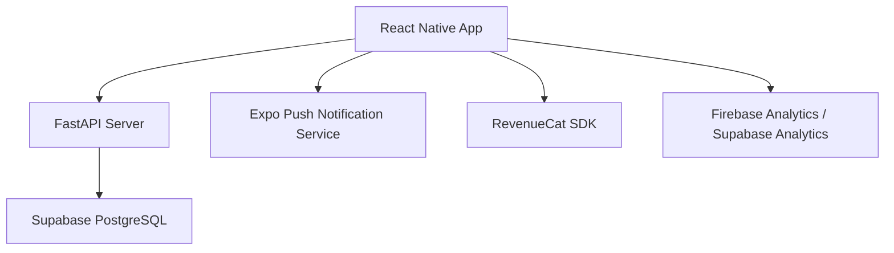

# Technical Requirements Document (TRD)

## 1. Executive Technical Summary

- **Project Overview**: Circly 앱은 익명 투표를 통해 중·고등학생들이 친구들을 칭찬하고 평가하며 FOMO를 유발하는 모바일 앱입니다. React Native (Expo) 프론트엔드, FastAPI 백엔드, Supabase (PostgreSQL) 데이터베이스, RevenueCat SDK를 사용해 개발됩니다.
- **Core Technology Stack**: React Native (Expo), FastAPI, Supabase (PostgreSQL), RevenueCat SDK
- **Key Technical Objectives**: 높은 투표 참여율, 재방문율, 사용자당 초대 전송수를 달성하고, 안정적이고 확장 가능한 시스템을 구축합니다.
- **Critical Technical Assumptions**: 사용자들은 대부분 모바일 환경에서 앱을 사용하며, 안정적인 네트워크 연결을 가정합니다. 개인 정보 보호와 데이터 보안을 최우선으로 고려합니다.

## 2. Tech Stack

| Category          | Technology / Library        | Reasoning (Why it's chosen for this project) |
| ----------------- | --------------------------- | -------------------------------------------- |
| Frontend          | React Native (Expo)         | 크로스 플랫폼 개발, 빠른 프로토타입 제작, Z세대 사용자에게 적합한 UI/UX 제공 |
| Backend           | FastAPI                     | 빠른 개발 속도, 높은 성능, 비동기 처리 지원, Python의 생산성 |
| Database          | Supabase (PostgreSQL)       | 확장성, 안정성, 실시간 데이터 처리, 오픈 소스, Firebase 대안 |
| Authentication    | Supabase Auth               | 간편한 인증 및 사용자 관리, 소셜 로그인 지원 |
| Push Notification | Expo Push Notification Service (or FCM via Expo) | React Native 환경에서 간편하게 푸시 알림 구현 |
| Subscription      | RevenueCat SDK              | 구독 및 인앱 결제 관리, 크로스 플랫폼 지원 |
| State Management  | Context API / Zustand       | 간단한 상태 관리, React Native에 적합 |
| UI Library        | React Native Paper / NativeBase | 일관된 UI 컴포넌트 제공, 개발 속도 향상 |
| Analytics         | Firebase Analytics / Supabase Analytics | 사용자 행동 분석, 앱 성능 측정 |
| API Client        | Axios / Fetch API          | HTTP 요청 처리 |

## 3. System Architecture Design

### Top-Level building blocks

- **Frontend (React Native App)**:
    - UI 컴포넌트: 사용자 인터페이스를 구성하는 React Native 컴포넌트
    - 상태 관리: 앱의 상태를 관리 (Context API or Zustand)
    - API 클라이언트: 백엔드 API와 통신 (Axios or Fetch API)
    - 푸시 알림: 사용자에게 알림 전송 (Expo Push Notification Service)
- **Backend (FastAPI Server)**:
    - API 엔드포인트: 프론트엔드 요청을 처리하는 API 엔드포인트
    - 비즈니스 로직: 투표 생성, 참여, 결과 계산 등의 핵심 로직
    - 데이터베이스 연동: Supabase (PostgreSQL) 데이터베이스와 연동
    - 인증 및 권한 부여: 사용자 인증 및 권한 관리 (Supabase Auth)
- **Database (Supabase PostgreSQL)**:
    - 투표 데이터: 투표 질문, 선택지, 참여자 정보 저장
    - 사용자 데이터: 사용자 정보, Circle 정보 저장
    - Circle 데이터: Circle 정보 저장
    - 결과 데이터: 투표 결과 저장
- **External Services**:
    - Expo Push Notification Service: 푸시 알림 전송
    - RevenueCat SDK: 구독 및 인앱 결제 관리
    - Firebase Analytics / Supabase Analytics: 사용자 행동 분석

### Top-Level Component Interaction Diagram



- React Native 앱은 FastAPI 서버에 API 요청을 보내 데이터를 가져오거나 업데이트합니다.
- FastAPI 서버는 Supabase PostgreSQL 데이터베이스에 데이터를 저장하고 조회합니다.
- React Native 앱은 Expo Push Notification Service를 통해 푸시 알림을 받습니다.
- React Native 앱은 RevenueCat SDK를 통해 구독 및 인앱 결제를 관리합니다.
- React Native 앱은 Firebase Analytics / Supabase Analytics를 통해 사용자 행동 데이터를 수집합니다.

### Code Organization & Convention

**Domain-Driven Organization Strategy**

- **Domain Separation**: 사용자 관리, 투표 관리, Circle 관리, 결제 관리 등의 도메인으로 분리
- **Layer-Based Architecture**: 프레젠테이션 레이어 (UI 컴포넌트), 비즈니스 로직 레이어, 데이터 접근 레이어, 인프라 레이어
- **Feature-Based Modules**: 각 기능별 모듈 (예: 투표 생성, 투표 참여, 결과 확인)
- **Shared Components**: 공통 유틸리티, 타입, 재사용 가능한 컴포넌트

**Universal File & Folder Structure**

```
/
├── src/
│   ├── components/          # 재사용 가능한 UI 컴포넌트
│   │   ├── Button.tsx
│   │   ├── Input.tsx
│   │   └── ...
│   ├── screens/             # 앱 화면
│   │   ├── HomeScreen.tsx
│   │   ├── CreatePollScreen.tsx
│   │   └── ...
│   ├── services/           # API 클라이언트, 데이터 접근 로직
│   │   ├── api.ts
│   │   ├── auth.ts
│   │   └── ...
│   ├── utils/              # 유틸리티 함수
│   │   ├── helpers.ts
│   │   ├── constants.ts
│   │   └── ...
│   ├── context/            # 상태 관리 (Context API)
│   │   ├── AuthContext.tsx
│   │   ├── PollContext.tsx
│   │   └── ...
│   ├── types/              # 타입 정의
│   │   ├── poll.ts
│   │   ├── user.ts
│   │   └── ...
│   ├── App.tsx             # 앱 진입점
│   └── index.tsx           # Expo 진입점
├── backend/              # FastAPI 백엔드 코드
│   ├── app/
│   │   ├── main.py        # FastAPI 앱 인스턴스
│   │   ├── models/        # 데이터 모델 (Pydantic)
│   │   │   ├── poll.py
│   │   │   ├── user.py
│   │   │   └── ...
│   │   ├── routers/       # API 엔드포인트
│   │   │   ├── poll.py
│   │   │   ├── user.py
│   │   │   └── ...
│   │   ├── database.py    # 데이터베이스 연결 및 설정
│   │   ├── utils/         # 백엔드 유틸리티 함수
│   │   └── config.py      # 설정 파일
│   ├── requirements.txt   # Python 패키지 의존성
│   └── Dockerfile         # Docker 설정 파일
├── .env                  # 환경 변수
├── package.json          # React Native 패키지 의존성
├── tsconfig.json         # TypeScript 설정 파일
└── README.md
```

### Data Flow & Communication Patterns

- **Client-Server Communication**: React Native 앱은 Axios/Fetch API를 사용하여 FastAPI 서버에 HTTP 요청을 보냅니다. FastAPI 서버는 JSON 형식으로 응답합니다.
- **Database Interaction**: FastAPI 서버는 SQLAlchemy ORM을 사용하여 Supabase PostgreSQL 데이터베이스와 상호 작용합니다.
- **External Service Integration**: React Native 앱은 Expo Push Notification Service를 사용하여 푸시 알림을 보냅니다. RevenueCat SDK를 사용하여 구독 및 인앱 결제를 처리합니다.
- **Real-time Communication**: 투표 결과 실시간 업데이트를 위해 Supabase Realtime 또는 WebSocket 고려
- **Data Synchronization**: 데이터 일관성을 위해 트랜잭션 관리 및 낙관적 잠금 사용

## 4. Performance & Optimization Strategy

- 이미지 최적화: 이미지 크기 압축 및 CDN 사용
- 코드 분할: 필요한 코드만 로드하여 초기 로딩 시간 단축
- 데이터베이스 쿼리 최적화: 인덱싱, 쿼리 캐싱 활용
- API 응답 캐싱: 자주 사용되는 API 응답 캐싱
- 메모리 누수 방지: 불필요한 메모리 점유 방지

## 5. Implementation Roadmap & Milestones

### Phase 1: Foundation (MVP Implementation)

- **Core Infrastructure**: React Native (Expo) 프로젝트 설정, FastAPI 백엔드 설정, Supabase 데이터베이스 설정, RevenueCat SDK 연동
- **Essential Features**: 익명 투표 생성/참여, Circle 초대 링크/코드, 푸시 알림, 결과 요약 카드
- **Basic Security**: 사용자 인증, 데이터 암호화, API 보안
- **Development Setup**: 개발 환경 설정, CI/CD 파이프라인 구축
- **Timeline**: 8주

### Phase 2: Feature Enhancement

- **Advanced Features**: 실시간 결과 애니메이션, 포인트/레벨 시스템, 질문 템플릿
- **Performance Optimization**: 코드 최적화, 데이터베이스 쿼리 최적화, 캐싱
- **Enhanced Security**: 보안 취약점 점검 및 개선, 개인 정보 보호 강화
- **Monitoring Implementation**: 시스템 모니터링, 오류 로깅, 성능 분석
- **Timeline**: 6주

## 6. Risk Assessment & Mitigation Strategies

### Technical Risk Analysis

- **Technology Risks**: React Native/FastAPI/Supabase 기술 스택의 학습 곡선, 예상치 못한 기술적 문제 발생 가능성
    - **Mitigation Strategies**: 충분한 기술 검토, 기술 전문가 자문, 문제 발생 시 빠른 해결을 위한 팀 협력
- **Performance Risks**: 사용자 증가에 따른 서버 부하 증가, 데이터베이스 성능 저하
    - **Mitigation Strategies**: 서버 확장, 데이터베이스 튜닝, 캐싱 전략, 코드 최적화
- **Security Risks**: 사용자 데이터 유출, 악성 공격, 개인 정보 침해
    - **Mitigation Strategies**: 보안 취약점 점검, 데이터 암호화, 접근 제어, 보안 정책 준수
- **Integration Risks**: 외부 서비스 (Expo Push Notification Service, RevenueCat SDK) 연동 실패, API 변경
    - **Mitigation Strategies**: 충분한 테스트, API 변경에 대한 빠른 대응, 대체 서비스 검토

### Project Delivery Risks

- **Timeline Risks**: 개발 지연, 예상치 못한 문제 발생으로 인한 일정 지연
    - **Contingency Plans**: 예비 일정 확보, 우선순위 조정, 추가 인력 투입
- **Resource Risks**: 개발 인력 부족, 기술 전문가 부족
    - **Contingency Plans**: 추가 인력 채용, 외부 전문가 활용
- **Quality Risks**: 코드 품질 저하, 테스트 부족으로 인한 버그 발생
    - **Contingency Plans**: 코드 리뷰 강화, 충분한 테스트, 자동화된 테스트 환경 구축
- **Deployment Risks**: 배포 실패, 환경 설정 오류
    - **Contingency Plans**: 배포 전 충분한 테스트, 자동화된 배포 시스템 구축
